# 23 Design Patterns Overview

## 1. Creational Patterns

| Pattern Name                             | Intent                                                                      | Applicable Scenarios                                            | Key Participants                                                           | Examples                                                              |
| ---------------------------------------- | --------------------------------------------------------------------------- | --------------------------------------------------------------- | -------------------------------------------------------------------------- | --------------------------------------------------------------------- |
| *1.1 Abstract Factory - Object Creation* | Provides an interface for creating families of related or dependent objects | Used to create a product family                                 | AbstractFactory, ConcreteFactory, AbstractProduct, ConcreteProduct, Client | javax.xml.parsers.DocumentBuilderFactory, springframework.BeanFactory |
| *1.2 Builder - Object Creation*          | Abstracts the construction process of complex objects                       | When object creation is complex and varies by configuration     | Builder, ConcreteBuilder, Director, Product, Client                        | org.springframework.web.client.RestClient.Builder                     |
| *1.3 Factory Method - Object Creation*   | Defer instantiation to subclasses                                           | When exact type to instantiate is not known                     | Product, ConcreteProduct, Creator, ConcreteCreator, Client                 | java.sql.Driver, sun.util.spi.CalendarProvider                        |
| *1.4 Prototype - Object Creation*        | Clone objects instead of creating new ones via `new`                        | When many objects share similar state and creation is expensive | Prototype, ConcretePrototype                                               | jdk Cloneable (shallow copy), Object serialization (deep copy)        |
| *1.5 Singleton - Object Creation*        | Ensure a class has only one instance                                        | For expensive objects or centralized access points              | Singleton                                                                  | Spring BeanFactory, DB connection manager                             |

### UML Diagrams for Creational Patterns

* Abstract Factory: 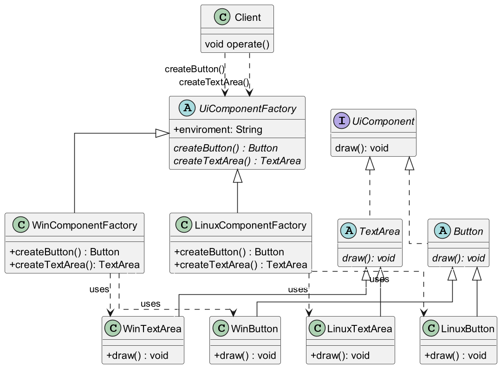
* Builder: 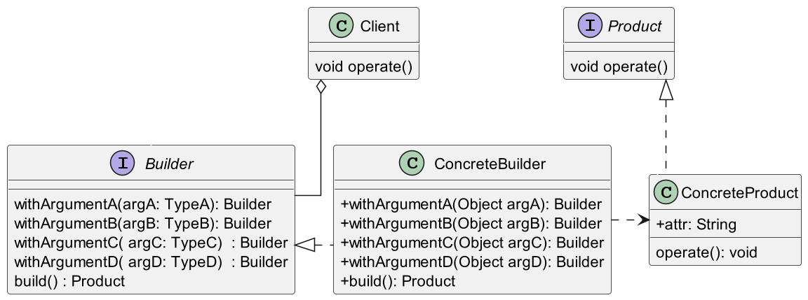
* Factory Method: 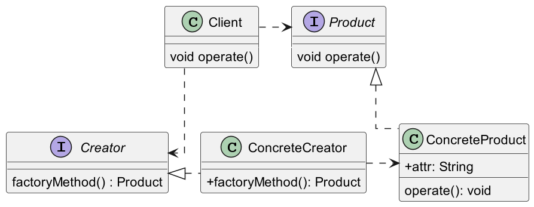
* Prototype: 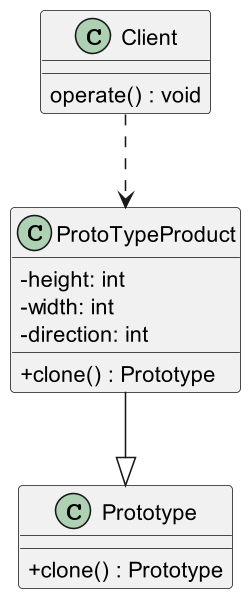
* Singleton: 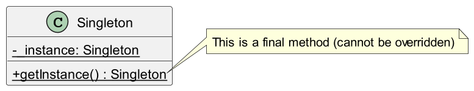

## 2. Behavioral Patterns

| Pattern Name                                    | Intent                                               | Applicable Scenarios                                    | Key Participants                                                               | Examples                                                                   |
| ----------------------------------------------- | ---------------------------------------------------- | ------------------------------------------------------- | ------------------------------------------------------------------------------ | -------------------------------------------------------------------------- |
| *2.1 Chain of Responsibility - Object Behavior* | Allow multiple objects to handle a request           | Help buttons, event propagation                         | Handler, ConcreteHandler, Client                                               | Java Servlet Filter, Spring FilterChainProxy, HandlerInterceptor           |
| *2.2 Command - Object Behavior*                 | Decouple sender and receiver                         | Support undo/redo, command queues                       | Command, ConcreteCommand, Receiver, Client, Invoker                            | Runnable/Thread, Spring MVC Controller structure                           |
| *2.3 Interpreter - Class Behavior*              | Interpret language grammar                           | Custom DSL interpreters, syntax trees                   | AbstractExpression, TerminalExpression, NonTerminalExpression, Context, Client | java.util.regex, Spring SpEL                                               |
| *2.4 Iterator - Object Behavior*                | Provide a way to access elements sequentially        | Iteration without exposing internal structure           | Iterator, ConcreteIterator, Aggregate, ConcreteAggregate, Client               | java.util.Iterator                                                         |
| *2.5 Mediator - Object Behavior*                | Simplify communication between components            | UI components communication, complex module interaction | Mediator, ConcreteMediator, ColleagueA/B                                       | Spring ApplicationEventPublisher, ApplicationListener                      |
| *2.6 Memento - Object Behavior*                 | Capture and restore object state                     | Snapshot state without exposing internals               | Caretaker, Originator, Memento                                                 | Serializable API                                                           |
| *2.7 Observer - Object Behavior*                | Notify dependents of state changes                   | Event-driven systems, publish-subscribe                 | Subject, ConcreteSubject, Observer, ConcreteObserver                           | java.util.Observable, Spring ApplicationEventPublisher with @EventListener |
| *2.8 State - Object Behavior*                   | Encapsulate behavior per object state                | State-driven logic, avoid if/else/switch chains         | Context, State, ConcreteState                                                  | Fan state transitions, Button-driven behavior changes                      |
| *2.9 Strategy - Object Behavior*                | Encapsulate interchangeable algorithms               | Run-time algorithm flexibility, replace `if-else` logic | Context, Strategy, ConcreteStrategy                                            | Comparator, Spring DiscountStrategy/VipDiscountStrategy                    |
| *2.10 Template Method - Class Behavior*         | Define algorithm skeleton, defer steps to subclasses | Common process with varying steps                       | AbstractClass, Subclasses                                                      | JdbcTemplate, RestTemplate, RedisTemplate, query/execute, RowMapper.mapRow |
| *2.11 Visitor - Object Behavior*                | Add operations without modifying object structure    | Separate behavior from object structure                 | Visitor, ConcreteVisitor, Node, ConcreteNode                                   | javax.lang.model.util.SimpleElementVisitor9, Spring BeanDefinitionVisitor  |

### UML Diagrams for Behavioral Patterns

* Chain of Responsibility: 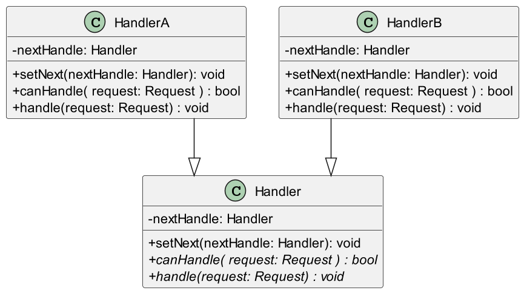
* Command: 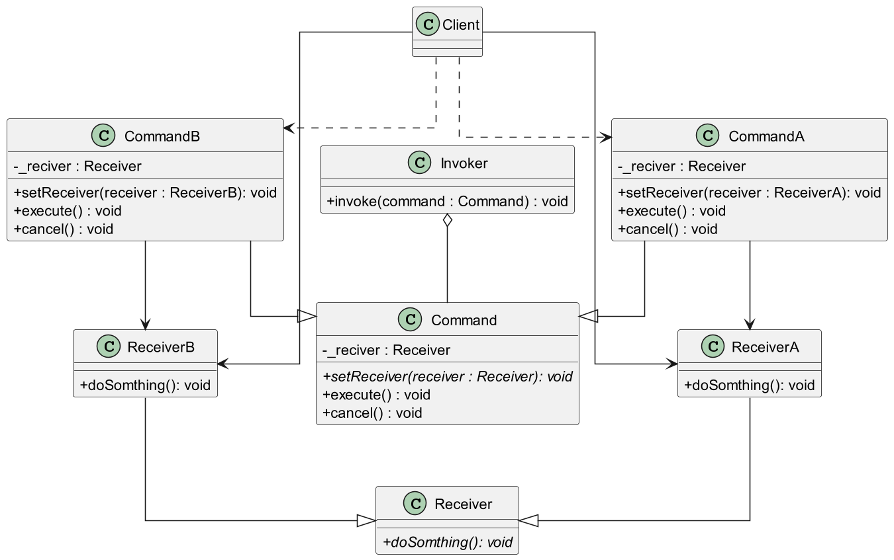
* Interpreter: 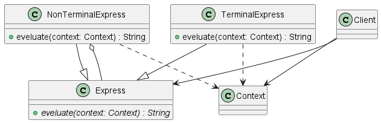
* Iterator: 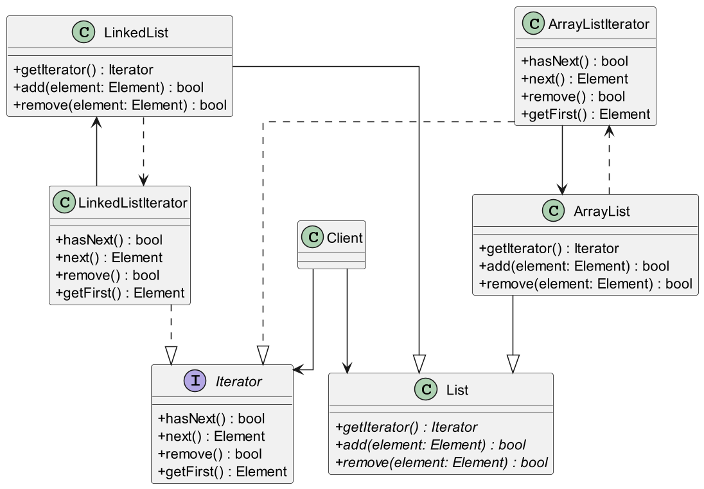
* Mediator: 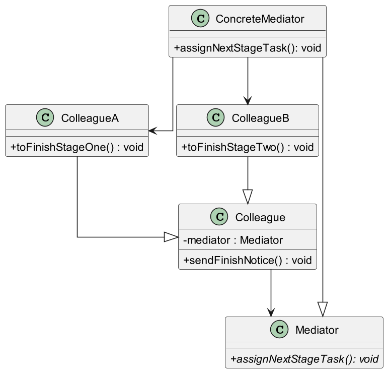
* Memento: 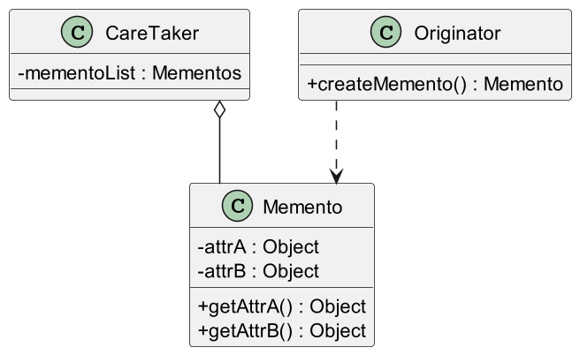
* Observer: 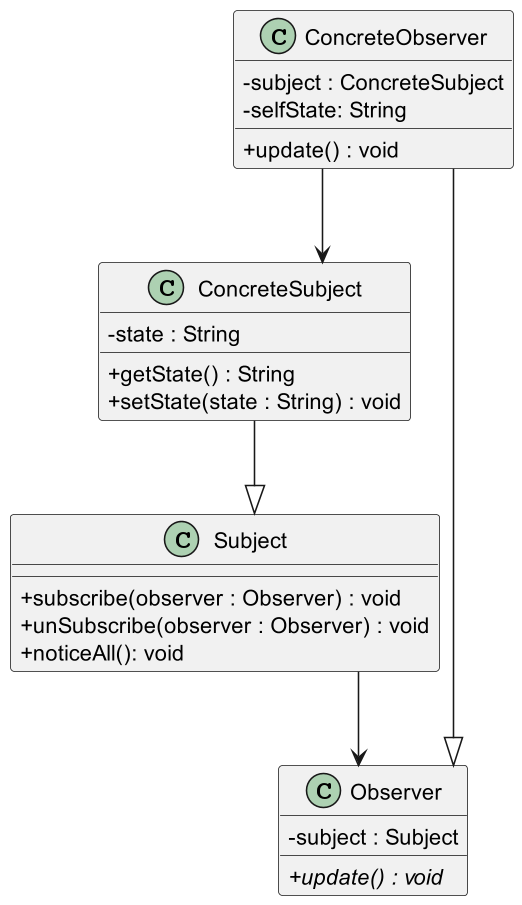
* State: 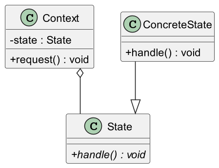
* Strategy: 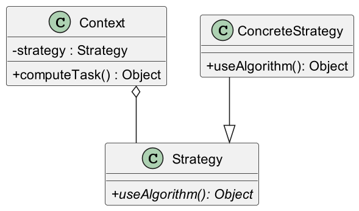
* Template Method: 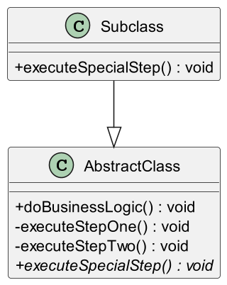
* Visitor: 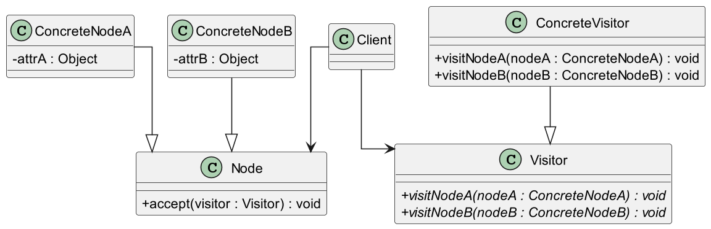

## 3. Structural Patterns

| Pattern Name                           | Intent                                            | Applicable Scenarios                                    | Key Participants                                                  | Examples                                                                                                   |
| -------------------------------------- | ------------------------------------------------- | ------------------------------------------------------- | ----------------------------------------------------------------- | ---------------------------------------------------------------------------------------------------------- |
| *3.1 Adapter - Class/Object Structure* | Make incompatible interfaces work together        | Bridge legacy systems and new interfaces                | Target, Client, Adaptee, Adapter                                  | FileInputStream/InputStreamReader/Reader, SpringMVC HandlerAdapter, Spring Security AuthenticationProvider |
| *3.2 Bridge - Object Structure*        | Decouple abstraction and implementation           | Independent evolution of interfaces and implementations | Abstraction, RefinedAbstraction, Implementor, ConcreteImplementor | JdbcTemplate/DataSource, Spring CacheManager/Cache                                                         |
| *3.3 Composite - Object Structure*     | Uniform treatment of part-whole hierarchy         | Recursive structure like file systems, UI components    | Component, Leaf, Composite, Client                                | java.io.File, java.awt.Container & Component                                                               |
| *3.4 Decorator - Object Structure*     | Add responsibilities dynamically                  | Add behavior without modifying class, chain behavior    | Component, Decorator, ConcreteComponent, ConcreteDecorator        | java.io.InputStream, FileInputStream, BufferedInputStream                                                  |
| *3.5 Facade - Object Structure*        | Simplify complex systems with a unified interface | Simplify usage, API wrapping                            | Facade, Subsystem classes                                         | java.util.logging.Logger, JdbcTemplate                                                                     |
| *3.6 Flyweight - Object Structure*     | Share objects to save memory                      | Large volumes of objects with shared state              | Flyweight, ConcreteFlyweight, FlyweightFactory                    | String pool, Integer.valueOf, Spring bean reuse                                                            |
| *3.7 Proxy - Object Structure*         | Control access to another object                  | Access control, lazy loading, AOP                       | Proxy, Subject, RealSubject                                       | java.lang.reflect.Proxy, Spring AOP Proxies                                                                |

### UML Diagrams for Structural Patterns

* Adapter (Class): 
* Adapter (Object): 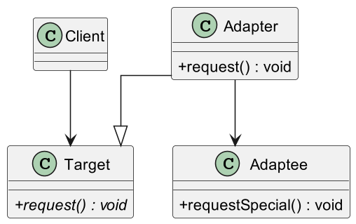
* Bridge: 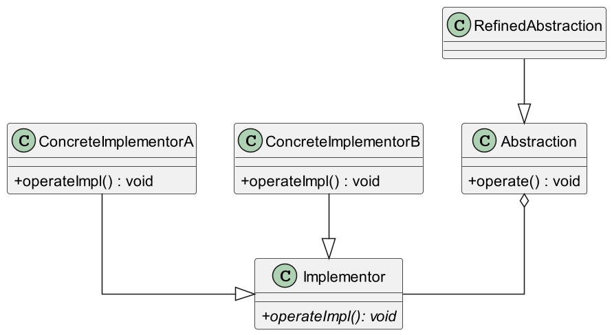
* Composite: 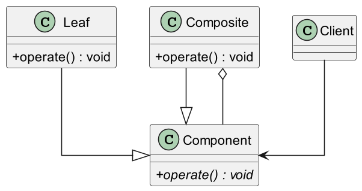
* Decorator: 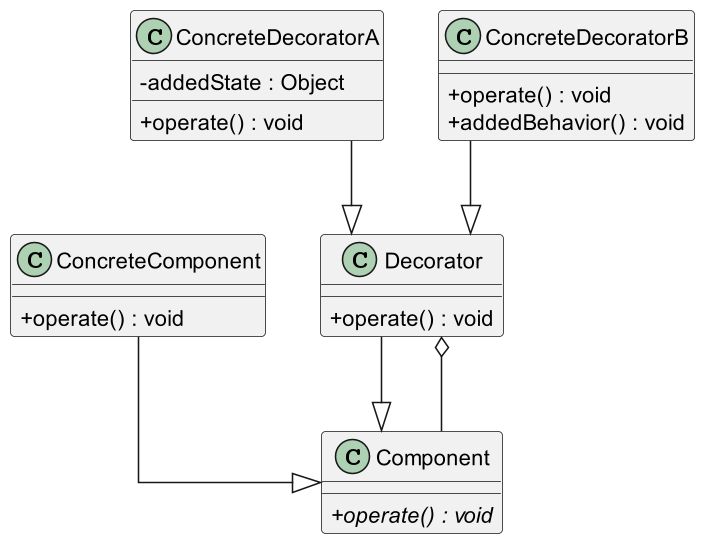
* Facade: 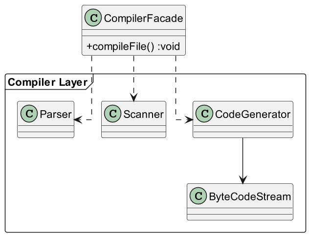
* Flyweight: 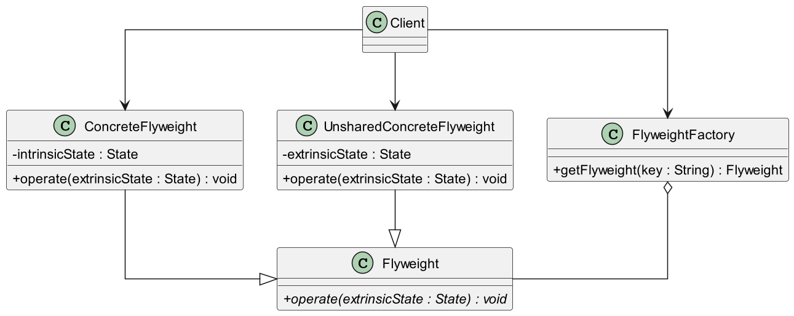
* Proxy: 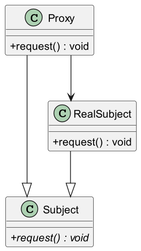
